# Deployment Guide

## Raspberry Pi Deployment

The Raspberry Pi can be used a test device to create a captive portal. The deployment script automates the setup of the Flask application, database, and necessary services to run a captive portal on the Raspberry Pi.

For easy deployment on a Raspberry Pi with Nginx as a reverse proxy, a comprehensive deployment script is included.

### Deployment Flow

Below is a visual representation of the deployment workflow:

```mermaid
flowchart TD
    start([Start]) --> parse[Parse Command Line Arguments]
    parse --> checkRoot[Check Root Permissions]
    checkRoot --> updateSystem{Update System?}
    
    updateSystem -->|Yes| doUpdate[Update System Packages]
    updateSystem -->|No| skipUpdate[Skip System Update]
    doUpdate --> installDep
    skipUpdate --> installDep
    
    installDep[Install Dependencies] --> setupDirs[Set Up Application Directories]
    setupDirs --> cloneRepo[Clone/Copy Repository]
    cloneRepo --> configEnv[Configure Environment]
    
    configEnv --> deployMethod{Use Docker?}
    
    deployMethod -->|Yes| dockerSetup[Set Up Docker Environment]
    deployMethod -->|No| directSetup[Set Up Python Environment]
    
    directSetup --> setupDB[Initialize Database]
    setupDB --> createAdmin[Create Admin User]
    createAdmin --> createService[Create Systemd Service]
    
    dockerSetup --> createComposeFile[Create docker-compose File]
    createComposeFile --> buildContainer[Build & Start Container]
    
    createService --> configNginx
    buildContainer --> configNginx
    
    configNginx[Configure Nginx Reverse Proxy] --> configNetwork[Configure Network]
    configNetwork --> verifyInstall[Verify Installation]
    
    verifyInstall --> setupCaptive{Set Up Captive Portal?}
    
    setupCaptive -->|Yes| installDnsmasq[Install dnsmasq & hostapd]
    setupCaptive -->|No| endPoint
    
    installDnsmasq --> configDnsmasq[Configure DNS Redirection]
    configDnsmasq --> configHostapd[Configure WiFi Access Point]
    configHostapd --> configInterfaces[Configure Network Interfaces]
    configInterfaces --> setupIptables[Set Up IP Forwarding & NAT]
    setupIptables --> enableServices[Enable Required Services]
    enableServices --> rebootPrompt{Reboot Now?}
    
    rebootPrompt -->|Yes| reboot[Reboot System]
    rebootPrompt -->|No| endPoint
    
    reboot --> endPoint
    endPoint([End])
    
    classDef decision fill:#ffcc99,stroke:#333,stroke-width:1px;
    classDef process fill:#bbdefb,stroke:#333,stroke-width:1px;
    classDef start fill:#b9f6ca,stroke:#333,stroke-width:1px;
    classDef endpoint fill:#ffcdd2,stroke:#333,stroke-width:1px;
    
    class start start;
    class endPoint endpoint;
    class updateSystem,deployMethod,setupCaptive,rebootPrompt decision;
    class doUpdate,skipUpdate,installDep,setupDirs,cloneRepo,configEnv,dockerSetup,directSetup,setupDB,createAdmin,createService,createComposeFile,buildContainer,configNginx,configNetwork,verifyInstall,installDnsmasq,configDnsmasq,configHostapd,configInterfaces,setupIptables,enableServices,reboot process;
```



### Requirements for Raspberry Pi

- Raspberry Pi with Raspberry Pi OS (formerly Raspbian)
- Sudo/root access
- Internet connection

### Deployment Options

The script supports multiple deployment methods:

1. Using Docker (recommended)
   - Containerized deployment
   - Less impact on the Raspberry Pi's filesystem
   - Automated database setup and migrations
   - Persistent SQLite database through volume mounts

2. Direct installation
   - Uses Python virtual environment
   - Local SQLite database with automated migration support
   - Managed by systemd service

### Basic Usage

```bash
# Copy the repository to your Raspberry Pi
# SSH into your Raspberry Pi
ssh pi@raspberry.local

# Navigate to the project directory and run the deployment script
cd captive-portal-platform
sudo ./deploy.sh
```

This will:

- Set up the Flask application with SQLite database
- Create the initial database migrations
- Set up a default admin user
- Configure the application for production use

### Advanced Options

The deployment script offers several options:

```bash
sudo ./deploy.sh --help            # Show help message
sudo ./deploy.sh --update-system   # Update the system before installation
sudo ./deploy.sh --no-docker       # Use direct installation instead of Docker
sudo ./deploy.sh --hostname myportal.local  # Set custom hostname
sudo ./deploy.sh --port 8080       # Use custom port for the Flask app
```

### Database Management on Raspberry Pi

After deployment, you can manage the database using the following commands:

#### With Docker Deployment

```bash
cd /opt/captive-portal
./docker.sh db-migrate "Description"  # Create a new migration
./docker.sh db-upgrade               # Apply migrations
./docker.sh backup-db                # Backup the database
```

#### With Direct Installation

```bash
cd /opt/captive-portal
source venv/bin/activate
FLASK_APP=wsgi.py flask db migrate -m "Description"  # Create a new migration
FLASK_APP=wsgi.py flask db upgrade                  # Apply migrations
```

### Captive Portal Functionality

The script can optionally set up full captive portal functionality:

- Creates a WiFi access point
- Redirects all web traffic to the login page
- Handles DNS and DHCP

This turns your Raspberry Pi into a complete, standalone captive portal solution.

### Accessing the Portal

After deployment:

1. The web interface is available at `http://captiveportal.local` (or your custom hostname)
2. If using the captive portal functionality, connect to the "CaptivePortal" WiFi network

## Production Deployment

### Using Docker (Recommended)

For production deployment, a separate Docker Compose file is provided with optimized settings:

```bash
# Set a secure secret key for production
export SECRET_KEY="your-secure-secret-key-here"

# Start the production containers
./docker.sh up prod
```

The production setup includes:

- Resource constraints for better host resource management
- No volume mounts for better security and stability
- Environment variable for the secret key
- Always restart policy for maximum uptime

### Using Gunicorn Directly

To run the application in production using Gunicorn:

```bash
pipenv run gunicorn -c gunicorn_config.py wsgi:app
```

This will start Gunicorn on `0.0.0.0:8000` as specified in the configuration file.
